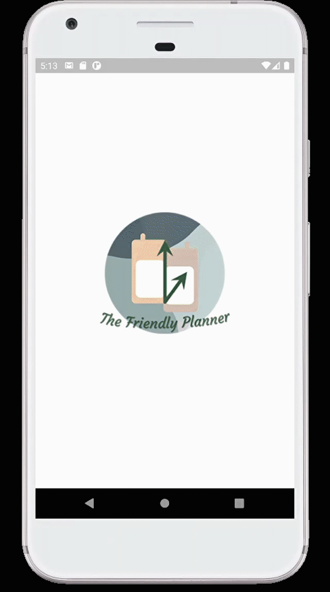

# The Friendly Planner (Flutter)
## Stay Organised. Declutter Your Life.

<!-- PROJECT LOGO -->
 

  

  <h3 align="center">The Friendly Planner</h3>

  

    A Flutter project done by an awesome group of 10!
     
    <a href="https://github.com/ChenZengYao/LifeBalance-flutter/tree/master/Final%20Submission"><strong>Final Submission »</strong></a>
     
     
    <a href="https://github.com/ChenZengYao/LifeBalance-flutter/blob/master/Final%20Submission/DIP%20Group%206%20Final%20Report%20-%20The%20Friendly%20Planner.pdf">Final Report</a>
    ·
    <a href="https://www.youtube.com/watch?v=WgHod7sdYPU&ab_channel=MarcusToo">Video Showcase</a>
    ·
    <a href="https://isorandom95.wixsite.com/dipgrp6">Website Showcase</a>
     
  
   
    <a href="https://github.com/ChenZengYao/LifeBalance-flutter/blob/master/Final%20Submission/DIP%20Group%206%20Poster.pdf">View Poster</a>
    ·
    <a href="https://github.com/ChenZengYao/LifeBalance-flutter/blob/master/Final%20Submission/The%20Friendly%20Planner%20Presentation%20Slides%20pdf.pdf">Presentation Slides</a>
    ·
    <a href="https://github.com/ChenZengYao/LifeBalance-flutter/blob/master/Final%20Submission/UserGuide.pdf">User Guide</a>
     
    
   
    <a href="https://github.com/ChenZengYao/LifeBalance-flutter/blob/master/Final%20Submission/Use%20Case%20Diagram%20For%20The%20Friendly%20Planner.png">User Case Diagram</a>
    ·
    <a href="https://github.com/ChenZengYao/LifeBalance-flutter/blob/master/Final%20Submission/TFP%20Flow%20diagram.pdf">Flow Diagram</a>
    ·
    <a href="https://github.com/ChenZengYao/LifeBalance-flutter/blob/master/Final%20Submission/Popplet.pdf">Popplet Planning</a>
      
  

## About The Project

